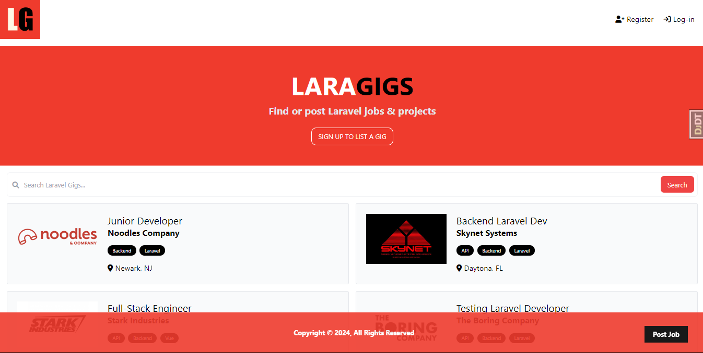
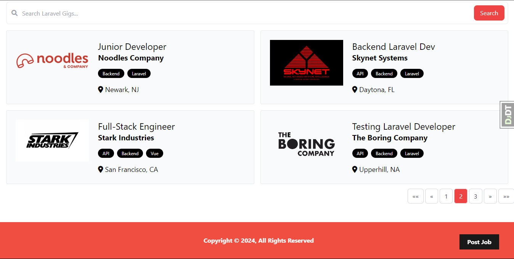

# Laragigs

**Laragigs** is a web application for listing Laravel gigs/jobs. Originally a tutorial project by Brad Traversy intended for Laravel, this version is built entirely with Django. The project serves as an introduction to the core functionalities of Django, showcasing a full-fledged job listing platform.

## Project Screenshots

|  |  |
|----------------------------------------------|----------------------------------------------|

## Features

1. **Authentication System**: Login & registration using Django's built-in authentication system.
2. **CRUD Functionality**: Create, read, update, and delete job listings.
3. **Filtering by Tags**: Listings can be filtered by tags using Django Taggit.
4. **Search Functionality**: Search through job listings by keywords.
5. **Pagination**: Paginated results for listings, filters, and search queries.
6. **User Management**: Authenticated users can manage their listings through a dedicated manage page.
7. **Custom Authentication**: Allows users to log in with their email and password.
8. **Django Message Framework**: Implemented for user feedback.
9. **Form Validations**: Comprehensive form validation to ensure data integrity.

## Installation Instructions

1. **Clone the repository:**

    ```bash
    git clone https://github.com/meenphilip/laragigs.git
    ```

2. **Install dependencies:**

    Using `Pipenv`:

    ```bash
    pipenv install -r requirements.txt
    ```

    Alternatively, you can use `pip` with the provided `requirements.txt` file:

    ```bash
    pip install -r requirements.txt 

    ```
    
3. **Set up the database:**

    Apply the migrations:

    ```bash
    python manage.py migrate
    ```

4. **Create a superuser:**

    ```bash
    python manage.py createsuperuser
    ```

    Follow the prompts to create a superuser account.

5. **Run the development server:**

    ```bash
    python manage.py runserver
    ```

6. **Access the application:**

    Open your web browser and go to `http://127.0.0.1:8000/`.


## Credits

This project is based on a tutorial by [Brad Traversy](https://github.com/bradtraversy). Special thanks to him for the inspiration and guidance.

- **Laragigs Repo**: [laragigs](https://github.com/bradtraversy/laragigs.git) 
- **Tutorial Video**: [YouTube - Laravel Gigs Project](https://www.youtube.com/watch?v=MYyJ4PuL4pY) 
- **Website**: [Traversy Media](https://www.traversymedia.com)
